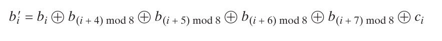
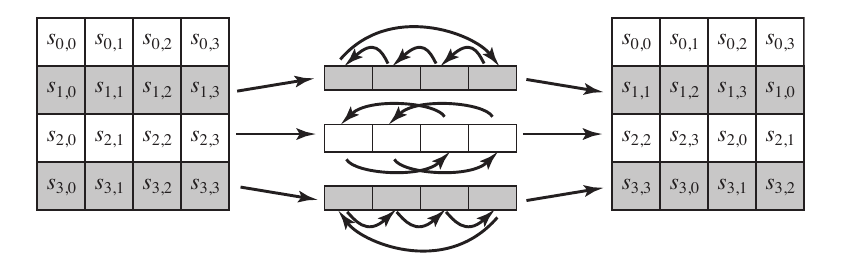

### SEGURANÇA DE REDES DE COMPUTADORES | 2022.2

Michel Oliveira

1. Qual foi o conjunto original de critérios usados pelo NIST para avaliar as cifras AES candidatas?

Segurança: A cifra deveria resistir a ataques criptográficos conhecidos, como ataques de força bruta, ataques diferenciais e criptoanálise linear. Além disso, ela também deveria ser resistente a ataques futuros, na medida do possível.
Eficiência computacional: A cifra deveria ser eficiente em termos de recursos computacionais necessários para criptografar e descriptografar dados. Isso inclui o tempo de execução e a utilização de memória.
Implementação: A cifra deveria ser adequada para implementação em uma ampla gama de dispositivos, desde sistemas de computadores de alto desempenho até dispositivos com recursos limitados, como smart cards e sensores.
Flexibilidade: A cifra deveria ser flexível o suficiente para suportar uma variedade de tamanhos de bloco, tamanhos de chave e modos de operação.
Simplicidade: A cifra deveria ser simples o suficiente para ser analisada de forma abrangente por especialistas em criptografia. A simplicidade promove a confiança na segurança da cifra.
Tamanho da chave: A cifra deveria suportar tamanhos de chave adequados para diferentes níveis de segurança, com um foco especial em tamanhos de chave de 128, 192 e 256 bits

2. Qual foi o conjunto final de critérios usados pelo NIST para avaliar as cifras AES candidatas?

Segurança: As cifras candidatas devem resistir a ataques conhecidos e não devem ter vulnerabilidades significativas. Elas devem garantir um alto nível de segurança, mesmo quando submetidas a ataques criptográficos avançados.
Eficiência: As cifras devem ser eficientes em termos de tempo de execução e uso de recursos computacionais. Elas devem permitir uma implementação rápida e eficiente em uma variedade de plataformas, incluindo dispositivos com recursos limitados.
Simplicidade: As cifras devem ter um design claro e compreensível. A simplicidade facilita a análise da segurança e aumenta a confiança na resistência da cifra a ataques.
Flexibilidade: As cifras devem ser flexíveis o suficiente para acomodar diferentes tamanhos de chave e blocos. Isso permite o uso da cifra em uma variedade de aplicativos e ambientes.
Maturidade: As cifras candidatas devem ser suficientemente estudadas e analisadas por especialistas em criptografia. A comunidade criptográfica deve ter confiança na segurança e eficácia das cifras propostas.
Implementação e uso prático: As cifras devem ser viáveis em termos de implementação prática e facilidade de uso em diferentes contextos. Isso inclui considerações como velocidade de criptografia/descriptografia, resistência a ataques laterais (side-channel attacks) e conformidade com padrões e regulamentações criptográficas.

3. Qual é a diferença entre Rijndael e AES?

A principal diferença entre Rijndael e AES é que Rijndael se refere ao algoritmo original proposto pelos criptógrafos, enquanto AES é a versão específica do Rijndael que foi selecionada como o padrão de criptografia pelo NIST. O AES é amplamente adotado e implementado em várias aplicações, enquanto Rijndael é usado como um termo mais geral para se referir ao algoritmo em si.

4. Responda:

a) Qual é a finalidade do array Estado?

Receber a cópia da matriz quadrada de bytes 4 x 4 de entrada dos algoritmos. Esse array é modificado a cada etapa de encriptação e decriptação. 

b) Como é construída a S-box?

A S-box é construída da seguinte forma:
i. Inicia-se com valores em byte em sequência crescente linha por linha. A primeira linha contém {00}, {01}, …, {0F}	; A segunda linha contém {10}, {11} e assim por diante, desse modo, o valor do byte na linha y, coluna x é {yx}.
ii. Mapeie cada byte com seu inverso multiplicativo no corpo finito GF(28); o valor {00} é mapeado consigo mesmo
iii. Considere que cada byte consiste em 8 bits rotulados (b7,b6,b5,b4,b3,b2,b1,b0). aplique a seguinte transformação a cada bit de cada byte na S-box:

c) Descreva rapidamente o estágio SubBytes, ShiftRows, MixColumns, AddRoundKey, e o algoritmo de expansão de chave.

SubBytes: Nesta etapa, cada byte do estado de dados é substituído por outro byte correspondente em uma S-Box (caixa de substituição), que é uma tabela não linear pré-definida. Essa substituição não linear ajuda a difundir os bits dos dados, aumentando a resistência a ataques.

ShiftRows: Nesta etapa, as linhas do estado de dados são deslocadas ciclicamente. A primeira linha permanece inalterada, a segunda linha é deslocada uma posição para a esquerda, a terceira linha é deslocada duas posições para a esquerda, e a quarta linha é deslocada três posições para a esquerda. Esse deslocamento ajuda a espalhar os bytes através das colunas, tornando o algoritmo mais resistente a ataques.

MixColumns: Nesta etapa, as colunas do estado de dados são misturadas por meio de operações de multiplicação e soma no corpo finito de Galois (GF(2^8)). Essa operação combina os bytes dentro de cada coluna para aumentar a difusão dos dados e a confusão da criptografia.

AddRoundKey: Nesta etapa, a chave de rodada é combinada com o estado de dados por meio de uma operação de XOR (ou exclusivo). Cada byte do estado de dados é combinado com o byte correspondente da chave de rodada. Essa operação garante que a chave de criptografia seja incorporada no estado de dados durante cada rodada.

Algoritmo de expansão de chave: Utiliza como entrada uma chave de 4 words (16 bytes) e produz um array linear de 44 words (176 bytes). Isso é suficiente para oferecer uma chave de rodada de 4 words para o estágio AddRoundKey inicial, e para cada uma das 10 rodadas da cifra. A chave é copiada para as 4 primeiras words e o restante é preenchido com 4 words de cada vez. Cada word incluída w[i] depende da anterior, w[-1] e da w[4-1]. Em 3 dentre 4 casos, é usado XOR. 

5. Quantos bytes no Estado são afetados por ShiftRows?

A primeira linha do estado não é alterada, a segunda linha é realizado um deslocamento linear a esquerda de 1 byte, a terceira linha um deslocamento circular a esquerda de 2 bytes e a quarta linha um deslocamento circular a esquerda de 4 bytes.

6. Use a chave 1010 0111 0011 1011 para encriptar o texto claro "ok" conforme expresso em ASCII, ou seja, 0110 1111 0110 1011. Os projetistas do S-AES obtiveram o texto cifrado 0000 0111 0011 1000. E você?

7. Compare AES com DES. Para cada um dos seguintes elementos do DES, indique o elemento comparável no AES ou explique por que ele não é necessário no AES.

a) XOR do material da subchave com a entrada da função f:

AES: No AES, o processo de chave de expansão gera as subchaves necessárias para cada rodada do algoritmo. As subchaves são geradas a partir da chave mestra usando um algoritmo específico. Não há necessidade de realizar um XOR separado entre o material da subchave e a entrada da função de mistura (chamada SubBytes no AES). O próprio processo de expansão da chave já incorpora a subchave em cada rodada.

b) XOR da saída da função f com a metade esquerda do bloco:

AES: No AES, o processo de mistura das colunas (chamado MixColumns) é aplicado à matriz de estado em cada rodada. Essa operação não é realizada em uma metade específica do bloco, mas sim em todo o bloco de 128 bits. Portanto, não há necessidade de realizar um XOR separado da saída da função de mistura com uma metade específica do bloco.

c) Função f:

AES: A função f no DES é composta por várias etapas, incluindo expansão, substituição e permutação. No AES, a função análoga é chamada de SubBytes, que realiza uma substituição não linear de cada byte do estado usando uma tabela de substituição específica (S-Box). Além disso, o AES também inclui etapas como ShiftRows e MixColumns para aumentar a difusão dos dados. Em geral, a função f no AES é mais complexa e abrangente do que no DES.

d) Permutação P:

AES: No DES, a permutação P é uma operação que rearranja os bits de saída da função f. No AES, uma operação semelhante é realizada como parte da etapa ShiftRows, que rearranja os bytes do estado. No entanto, a permutação P do DES não é diretamente comparável ao AES, pois os algoritmos possuem estruturas diferentes.

e) Troca de metades do bloco:

AES: No DES, uma etapa conhecida como troca de metades do bloco é realizada, onde as metades esquerda e direita do bloco são trocadas antes de cada rodada. No AES, não há uma etapa correspondente à troca de metades do bloco. O algoritmo AES trata todo o bloco de 128 bits como uma única entidade e não há necessidade de trocar metades do bloco durante a criptografia.
